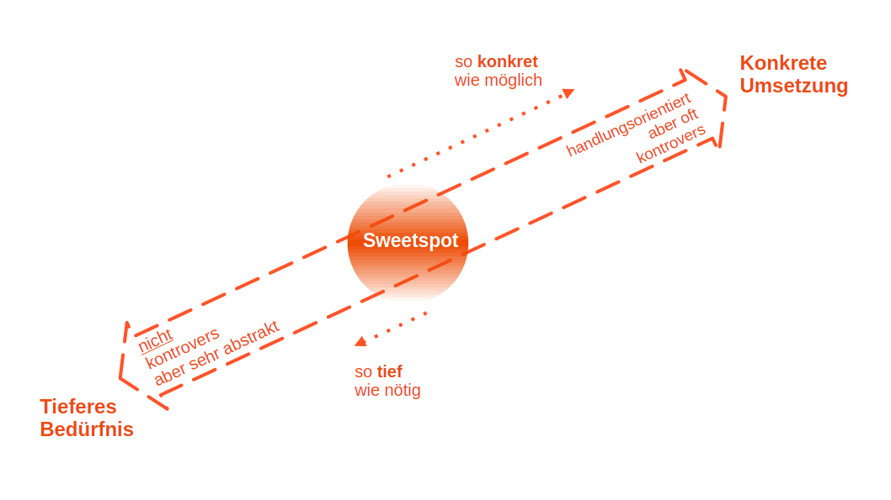
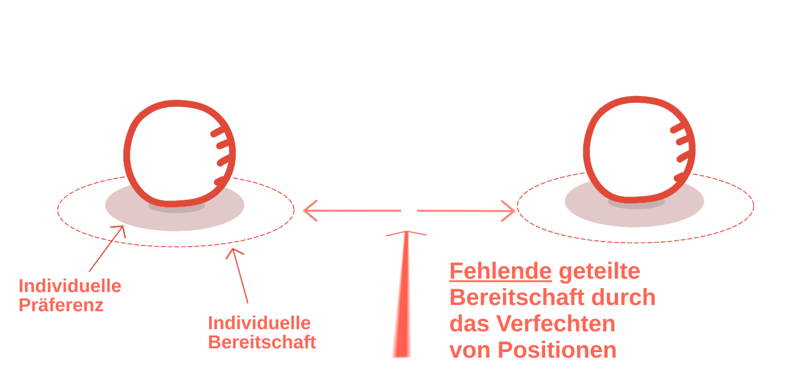
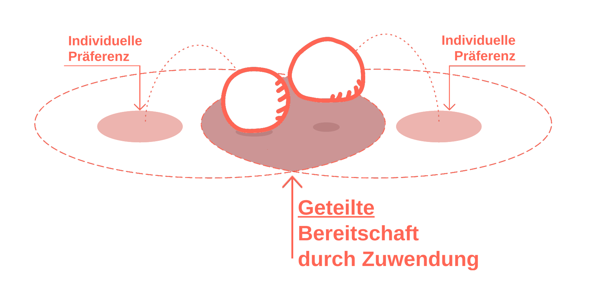
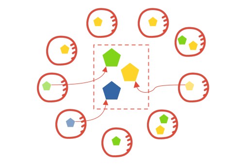

# Wie wir mit euch das Unmögliche bewegen.

Wir helfen allen in der Gruppe, zu teilen, was ihnen wichtig ist, sodass alle das zugrundeliegende „Warum“ verstehen können. Auf diesem gemeinsamen Verständnis entwickeln wir mit euch Lösungen, die das Warum aller beinhalten. Um das sicherzustellen, checken wir die Vorschläge auf Bedenken und integrieren diese. Wenn keine Bedenken mehr da sind, haben wir eine Entscheidung.

#### *Artet das nicht in ewige Diskussionen aus?*

Nein, denn durch unser Zuhören und gezieltes Zurückspiegeln helfen wir effektiv, die tiefere Essenz aufzuzeigen.

> A: *"Ich will, dass alle im Raum gleich viel sprechen!"*
>  
> **Kontrovers** für B: *"Ich will hier nicht ewig sitzen, da wiederholt sich doch alles!"*
>  
> Tiefere Essenz für Person A, die für Person B **nicht kontrovers** ist:  
> *"Ich will, dass alles, was wichtig ist, eingebracht werden kann."*

#### *Ja, okay, ich kann sehen, dass das Beispiel funktioniert, aber es gibt Menschen, die sind einfach zu unvernünftig.*

Wenn Menschen darauf vertrauen können, dass die tiefere Essenz, die ihnen wichtig ist, gehalten wird, können sie von konkreten Strategien loslassen, diese umzusetzen. Dann beginnt Magie möglich zu werden, denn häufig bringen die „unvernünftigsten“ Menschen die größten Schätze, wenn man einmal die tiefere Essenz ihres Anliegens begreift. Diese zugänglich zu machen, ist unser Job.

> A: *“Mir ist wichtig, dass alle an den Entscheidungen beteiligt sind!“*
> 
> **Kontrovers** für B: *"Das geht gar nicht für mich, da komme ich ja gar nicht mehr voran mit meiner Arbeit.“*
> 
> Tiefere Essenz für Person A, die für Person B **nicht kontrovers** ist:  
> A: *"Mir ist wichtig, dass wir gemeinsam entscheiden, für wen es wichtig ist wann wo mitzuentscheiden."*

#### Okay, tell me more – wie funktioniert das im Detail, was ihr macht?

Im Kern dessen, was wir hier anbieten, ist die Annahme, dass alles was Menschen tun (ja, auch gewaltvolle Taten), auf ein tiefer liegendes, lebensdienliches Bedürfnis zurückzuführen ist, und es an sich eine große Fülle an Möglichkeiten gibt, sich um dieses Bedürfnis zu kümmern. Und, wenn wir ausreichend dicht an dieses tiefere Bedürfnis herankommen, wenn wir die Essenz dessen, was einer Person so wichtig ist, für die Gruppe nachvollziehbar machen können, dann tauchen neue Lösungen auf.

### Vertrauen durch Zuwendung — statt Verfechten von Positionen

Unsere gesellschafltlich etablierte Diskussionskultur macht es uns allerdings oft schwer tiefer zu gehen, und gemeinsam zu gucken "was dahinter steckt". Stattdessen sind wir es gewöhnt, unsere Position zu verfechten indem wir andere versuchen durch Argumente zu überzeugen. Das Problem hierbei ist, dass wir schnell gegeneinander arbeiten, und unsere individuelle Sorge wächst, dass wir mit jeder "Zusage" an unser Gegenüber, etwas von dem was uns wichtig ist aufgeben müssen. Dieses Erleben vom Gegeneinander und vom Beschützen dessen was uns wichtig ist, führt dazu, dass die Bereitschaft eine Lösung außerhalb unserer Präferenz zu akzeptieren immer kleiner wird.  

Durch das von uns begleite Tiefergehen, durch das temporäre Distanzschaffen von einer konkreten Lösung, wird es für alle in der Gruppe leichter sich dem zuzuwenden, was anderen der am Herzen liegt. Unsere Begleitung macht es möglich Fürsorge auch über extreme Meinungsdifferenzen hinweg zu erleben. Und wenn wir als Menschen erleben, dass andere sich dem, was uns am Herzen liegt, ohne Widerstand zuwenden können, dann können wir uns entspannen und Vertrauen entwickeln, dass das, was uns so wichtig ist, von anderen berücksichtigt wird. Sobald wir dieses Vertrauen haben, ist es leichter über ein ganzheitliches Problem nachzudenken, und es erhöht sich unsere Bereitschaft mit Lösungen mitzugehen, die nicht unsere Präferenz sind.

### Alles was wichtig ist — aber nicht jede Stimme

Konträr zu vielen anderen kollaborativen Entscheidungsprozessen, haben wir nicht die Intention von jeder beteiligten und betroffen Person zu hören. Wir führen eine Liste (für die gesamte Gruppe) mit den Kriterien/Essenzen, die Menschen in der Gruppe berücksichtigt haben wollen. Wir fragen immer wieder alle, was für sie wichtig ist, das noch *nicht* auf dieser Liste steht. Im Idealfall müssen wir nur von wenigen Menschen aus der Gruppe hören, um alle Kriterien zu finden, und — basierend auf der Annahme, dass das Set zu berücksichtigender Aspekte/Bedürfnis endlich ist — auch mit großen Gruppen möglich, und gleichzeit schont es in jedem Fall die Ressourcen in der Gruppe.

### Klar definierter Entscheidungshorizont

Eine Entscheidung, die über möglicherweise Wochen oder sogar Monate getroffen wurde, ist keine Entscheidung, wenn sie am Folgetag direkt wieder verworfen wird. Gleichzeitig, fällt es Menschen schwerer ihr volles "Ja" für eine Entscheidung zu geben, wenn unklar ist für welchen Zeitraum diese Entscheidung jetzt gilt. Gerade bei Entscheidungen, wo wenig Informationen über die Auswirkungen dieser oder jener Lösung vorhanden sind, und solchen, die sich leicht immer wieder neu treffen lassen, achten wir darauf, klar zu definieren für wie lang diese Entscheidung gilt — 4 Woche, 6 Monate, 1 Jahr? 

### Nichts wird aufgegeben

Wenn wichtige Aspekte nicht integriert werden, dann reduziert das die Wahrscheinlichkeit einer (erfolgreichen) Umsetzung einer Entscheidung. Dann wird die Entscheidung zwar getroffen, aber die, die mitverantwortlich sind für die erfolgreiche Umsetzung, tragen möglicherweise noch Widerstände in sich und so tritt das eigentlich gewünschte Ergebnis eventuell nie ein. 

Wir begrüßen daher Einwände und Außenseiter Meinungen, da wir glauben, dass es wichtig — und möglich — ist diese zu integrieren, um eine solide, nachhaltige Entscheidung zu treffen.

### Vertrauen, dass es möglich ist

Und zu guter Letzt noch ein Aspekt der oft unsichtbar bleibt, aber für uns essentiell ist: Nur, wenn zumindest eine Person im Raum im vollen Vertrauens ist, dass eine Entscheidung, die für alle funktioniert, tatsächlich möglich ist, wird sie auch möglich.

Wir bringen dieses Vertrauen mit. Und wenn wir uns mal von der Herausforderung überwältigt fühlen und selbst das Vertrauen verlieren, dann haben wir ein starkes Unterstützungssystem um uns herum, das uns wieder aufbaut. 

### Was es von den Teilnehmenden braucht:

Die Bereitschaft den Prozess mit uns zu Beginnen.

--- 

# Bezugsquellen

Unsere Methodik basiert auf [Convergent Facilitation](https://convergentfacilitation.org), entwickelt von Miki Kashtan, sowie auf Zusätzen und Anpassungen entwickeltüber viele Jahre durch Roni Wiener im [Integration Station Collective](https://decisionsforall.org). Convergent Facilitation ist enstanden aus den Prinzipien der Gewaltfreien Kommunikation (nach Marshall Rosenberg) mit dem Fokus auf Gruppenentscheidungen.

