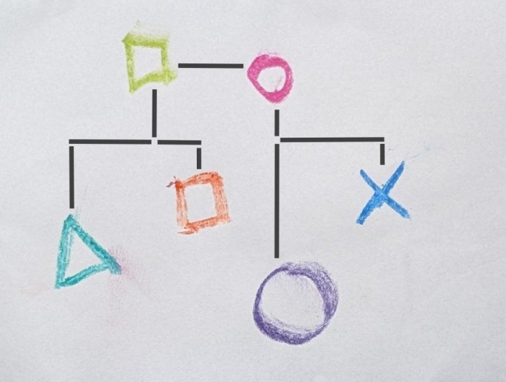
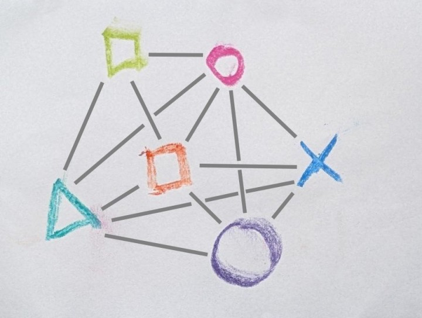
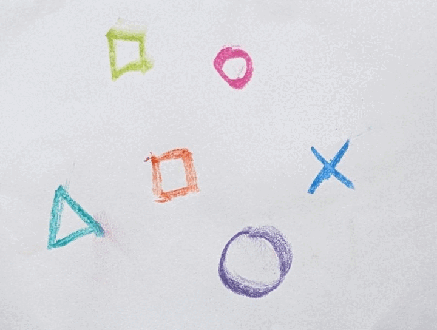
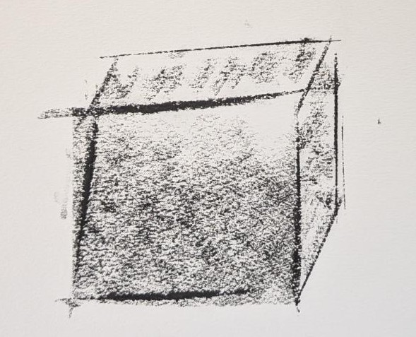

# Gemeinsam in Flow kommen
Wir alle treffen unendlich viele Entscheidungen jeden Tag. Von den meisten kriegen wir gar nichts mit, so schnell und unbewusst finden sie statt. Und dann gibt es eine Reihe von Entscheidungen — oft wiederkehrend — , die uns ins immer wieder ins Stolpern geraten lassen, wo Reibung entsteht, wo Vertrauen veloren geht, und wo am Ende womöglich dennoch nicht mal eine Entscheidung steht, dafür aber Misstrauen und Frustration.

Wenn wir grundsätzlich unser Verständnis erweitern was "Entscheiden" eigentlich im Detail bedeutet, entstehen neue Möglichkeiten als Gruppe und Organisation Bewegung und Momentum aufzubauen.

### Entscheidungsblockaden sind vielfältig

*"Kann ich das entscheiden?!"*

*"Müssen wirklich alle von dieser Entscheidung wissen?!"*

*"Dazu will ich am liebsten gar nichts hören!"*

*"Wer hat das denn entschieden?!"*

*"Kann das jetzt bitte einfach mal wer entscheiden!"*

*"Nicht schon wieder ein Meeting für 'ne Entscheidung!"*

*"Was heißt das eigentlich, 'Entscheiden'?"*

### Dynamisch, nutzenorientiert "für andere Führung gehen"

Starre Hierarchien definieren unter anderem wer (über wen) entscheidet, und auch wer Entscheidungen initiert und weiterbewegt. Das kann in gewissen Kontexten und Situationen hilfreich sein, es führt aber auch oft dazu, dass "Entscheider" zum Flaschenhals werden für Vorwärstbewegung,  dass gewisse Bedürfnisse einseitig priorisiert werden, oder dass die Menschen, die meisten Informationen haben noch nicht mal etwas von der Entscheidung mitbekommen. 

Im Kontrast dazu, macht es jegliche Abwesenheit von Hierarchie schwierig überhaupt Bewegung zu generieren und zu erhalten, auch kleine Entscheidungen brauchen viel Kraftaufwand, so werden am Ende weniger Entscheidungen getroffen.

Wenn wir aber zum Beispiel klären, 
- wann 
- wer 
- zu welchem Zweck
- auf welche Art und Weise 
- und für wie lange 

**"in Führung gehen"** kann — und zwar nicht für sich selbst, sondern *für alle* — dann kann Bewegung entstehen, die sowohl ermächtigt und gleichzeitig Flow für alle leichter möglich macht. 

# "System": Strukturen für wiederkehrende Situationen

Eine Küche ist ein System zur Zubereitung von Mahlzeiten. Wir wissen, dass wir wieder hungrig sein werden, und dafür sind bestimmte Werkzeuge und Abläufe hilfreich. Je nach Kontext, gibt es unterschiedliche eingerichtete Küchen und Abläufe. In allen Fällen, machen sie es uns aber leichter Essen zu zu bereiten, wenn wir es wollen. Die Abwesenheit eines — für uns hilfreiches — System lässt sich zum Beispiel bemerken, wenn wir an neuen Orten sind: Oft sind weniger, oder viel mehr Werkzeuge verfügbar, wir wissen nicht wo sie sind, oder sie sind an für uns schwierig erreichbaren Orten. Als Folge daraus dauert die Essenszubereitung oft länger und ist energieaufwändiger, oder das Ergebnis ist deutlich weniger beeindruckend, als das was wir sonst erbringen können. 

**Beim Entscheiden ist es ähnlich:** 

Ein Entscheidungssystem aus definierten Werkzeugen und Abläufen kann uns helfen 
- flexibler, schneller und mit weniger energieaufwand bessere Entscheidungen zu treffen
- uns zu kalibieren und dadurch ein geteiltes Verständnis zu kriegen wie wir Entscheidungen treffen wollen
- flexible Verantwortung zu verteilen
- ins Handeln zu kommen und Gewohnheiten zu ändern

### Abmachungen

Die Strukturen oder Elemente eines Entscheidungssystems sind für gewöhnlich nicht phyischer Natur, sondern nehmen die Gestalt von "Abmachungen" an.

**Für uns sind Abmachungen**:
- gemeinsam getroffene Vereinbarungen
- die allen als **unterstützende** Struktur dienen
- und sich (zu verschiedenen Graden) durch Dialog anpassen lassen. 

Im Kontrast dazu, werden "Regeln" häufig zum Erzwingen benutzt, und dazu meist nicht offen dafür durch Dialog angepasst zu werden. Die genauen Worte (Abmachungen/Regeln) sind uns hier nicht so wichtig; wichtig ist uns, dass die Struktur angepasst werden kann, wenn sie ihrem eigentlichen Zweck nicht mehr dient. 

# Die Entscheidungsblackbox zerlegen: Elemente eines Entscheidungssystem

Ebenso wie es in einer Küche verschiedene Elemente (Geräte) gibt, die besonders nützlich sind und in jeder Küche vorzufinden sind, gibt es auch beim Entscheiden verschiedene Elemente, die wir uns bewusst zunutze machen können, und so bessere Entscheidungen treffen können. "Elemente" sind im Fall von diesem Beispiel "Arten der Beteiligung" an der Entscheidung.

## Ein Beispiel: Essen für Opa

### "Entscheiden" = "Auswählen"?!

Die 10-jährige Armelle will für ihren Opa zum Geburtstag was ganz besonderes kochen. Alle wollen mitentscheiden. 

|Entscheidung: |Wer entscheidet?|
|-|-|
|Was kochen wir Opa zum Geburtstag?|10-Jährige, 7-Jährige, 4-Jähriger, Opa, Oma, Papa, Mama|

Entspricht die Aussage "Ich will mitentscheiden" zwangsläufig "Ich wähle aus was gekocht wird?"

|Entscheidung: |Wer wählt aus?|
|-|-|
|Was kochen wir Opa zum Geburtstag?|10-Jährige, 7-Jährige, 4-Jähriger, Opa, Oma, Papa, Mama|

### Input geben, Informiert werden, Auswählen

Stellt sich heraus, dass es Mama gar nicht darum geht auszuwählen was gekocht wird. Ihr ist nur wichtig, dass sie es essen kann. Sie möchte deshalb gerne Input geben, was ihr wichtig ist das beachtet wird, und sie will wissen was am Ende entschieden wurde. Opa möchte gerne teilen worauf er besonders große Lust hat. Er möchte aber eigentlich gar nicht wissen was entschieden ist, sondern vertraut darauf, dass es was leckeres sein wird und lässt sich lieber überraschen:

|Entscheidung:|Wer gibt Input?|Wer wählt aus?|Wer wird informiert?|
|-|-|-|-|
|Was kochen wir Opa zum Geburtstag?|Opa, Mama|10-Jährige, 7-Jährige, 4-Jähriger, Oma, Papa|Mama

### Vorschläge herausfiltern / Veto einlegen

Da Papa am Ende primär kochen wird, ist es ihm wichtig Vorschläge "herausfiltern" zu können, die er auf keinen Fall kochen möchte. Es ist ihm aber nicht wichtig auszuwählen was gekocht wird.

|Entscheidung:|...|Wer stimmt zu?|Wer wählt aus?|...|
|-|-|-|-|-|
|Was kochen wir Opa zum Geburtstag?|...|Papa|10-Jährige, 7-Jährige, 4-Jähriger, Oma|...

### Vorschläge generieren
Oma und die 7-Jährige haben richtig Lust sich was auszudenken, aber auch ihnen ist es nicht wichtig auszuwählen was von gekocht wird. 

|Entscheidung:|...|Wer macht Vorschläge?|...|Wer wählt aus?|...|
|-|-|-|-|-|-|
|Was kochen wir Opa zum Geburtstag?|...|Oma, 7-Jährige|...|10-Jährige, 4-Jähriger |...

### Die Entscheidung in Gang halten, Auswählen

Der 4-Jährige will unbedingt "entscheiden" was gekocht wird. Und der 10-jährigen ist vor allem wichtig, dass Opa überhaupt etwas besonderes gekocht bekommt, aber gar nicht so sehr was. Wie sie ihre Familie kennt, hat sie Sorge, dass die Entscheidung erst so spät angegangen wird, dass das dann nur noch wenige Optionen bestehen. Deshalb kümmert sie sich vor allem darum, dass die Entscheidung voran kommt, wenn sie ins Stocken gerät.

|Entscheidung:|Bringt und hält die Entscheidung in Gang|...|...|...|Wer wählt aus?|...|
|-|-|-|-|-|-|-|
|Was kochen wir Opa zum Geburtstag?|10-Jährige|...|...|...|4-Jähriger |...

## Überblick: Arten der Beteiligung

|Bezeichnung|Beschreibung|Wer hat diese Funktion im Beispiel übernommen
|---|---|-|
|**Initiieren und Definieren**| Sieht den Bedarf für eine Entscheidung und formuliert eine Entscheidungsfrage.|10-Jährige
|**In Bewegung halten**| Kümmert sich darum, dass die Entscheidung sich forwärts bewegt.|10-Jährige
|**Input geben**| Trägt Bedürfnisse, Meinungen und Ideen bei.|Opa, Mama
|**Generieren**| Erstellt Lösungsvorschläge basierend auf der Entscheidungsfrage und dem Input.|Oma, 7-Jährige
|**Feedback geben**| Gibt Rückmeldung zu den erstellten Lösungsvorschlägen.|—
|**Zustimmen**| Evaluiert Lösungsvorschläge in Bezug auf die Entscheidungsfrage und Input und kann Lösungvorschläge "heraussieben/filtern" (Veto einlegen). |Papa
|**Integrieren**| Passt die Lösungsvorschläge an, basierend auf dem Feedback an|—
|**Entscheiden**| Evaluiert die (verbleibenden) Lösungsvorschläge und **wählt genau einen Vorschlag aus**.|4-Jähriger
|**Informiert werden**| Wird über den Ausgang der Entscheidung informiert.|Mama
|**Ausführen**| Führt die Entscheidung aus.|Papa

# Übung und Kalibrieren

Wenn wir in der Küche neue Geräte benutzen oder uns an eine neue Ordnung gewöhnen, braucht es ein wenig, bis wir es rund läuft, und irgendwann denken wir gar nicht mehr drüber nach. Ähnlich ist es, wenn wir anfangen uns mit den verschiedenen Arten der Beteiligung auseinander zu setzen. Zuerst fühlt es sich ungewohnt an und es braucht etwas Zeit, und irgendwann können wir das Ganze intuitiv benutzen und flexibel nach Bedarf Entscheidungen treffen.  

--- 
# Bezugsquellen

Dieser Inhalt ist inspiriert durch die Arbeit von Miki Kashtan und Roni Wiener zu Organisations- und Entscheidungssystemen, sowie Dominic Barter zu "Dialogical Systems Design".

