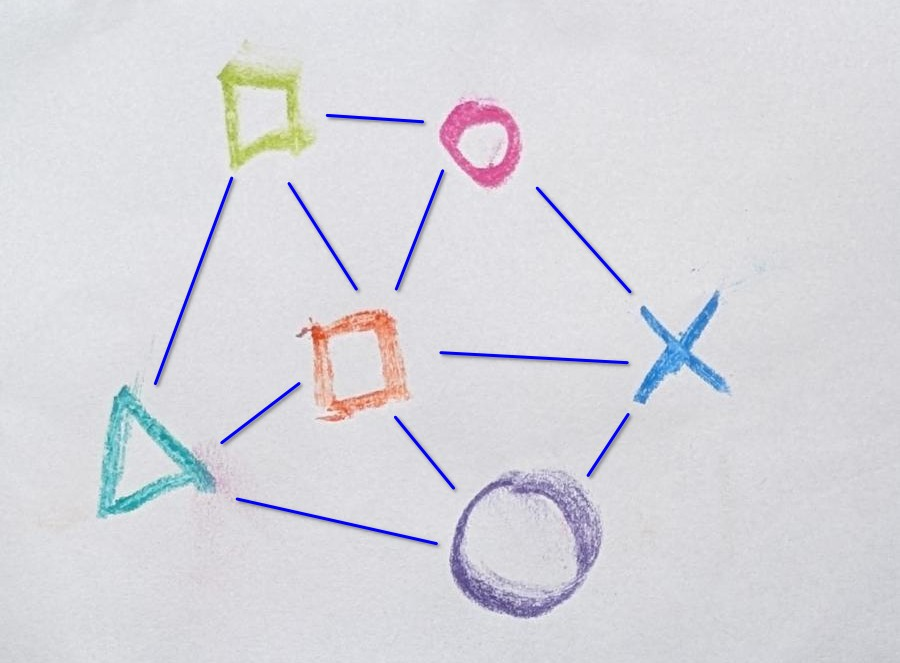
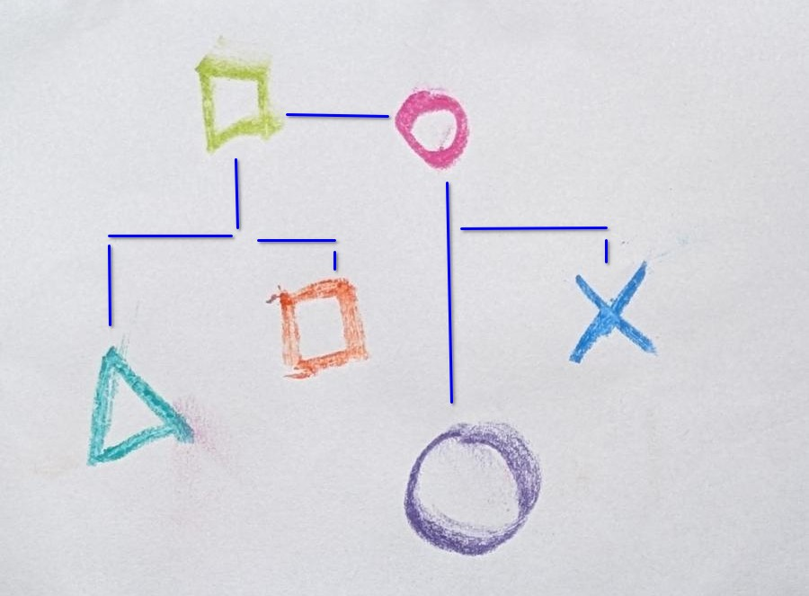

## Entscheidungsblockaden sind vielfältig

> *"Nicht schon wieder ein Meeting für 'ne Entscheidung!"*

## "System": Strukturen für wiederkehrende Situationen

Eine Küche ist ein System zur Zubereitung von Mahlzeiten. Wir wissen, dass wir wieder hungrig sein werden, und dafür sind bestimmte Werkzeuge und Abläufe hilfreich. Je nach Kontext, gibt es unterschiedliche eingerichtete Küchen und Abläufe. In allen Fällen, machen sie es uns aber leichter Essen zu zu bereiten, wenn wir es wollen. Die Abwesenheit eines — für uns hilfreiches — System lässt sich zum Beispiel bemerken, wenn wir an neuen Orten sind: Oft sind weniger, oder viel mehr Werkzeuge verfügbar, wir wissen nicht wo sie sind, oder sie sind an für uns schwierig erreichbaren Orten. Als Folge daraus dauert die Essenszubereitung oft länger und ist energieaufwändiger, oder das Ergebnis ist deutlich weniger beeindruckend, als das was wir sonst erbringen können. 

> *"Kann ich das entscheiden?!"*

**Beim Entscheiden ist es ähnlich:** 

Ein Entscheidungssystem aus definierten Werkzeugen und Abläufen kann uns helfen 
- flexibler, schneller und mit weniger energieaufwand bessere Entscheidungen zu treffen
- uns zu kalibieren und dadurch ein geteiltes Verständnis zu kriegen wie wir Entscheidungen treffen wollen
- flexible Verantwortung zu verteilen
- ins Handeln zu kommen und Gewohnheiten zu ändern

> *"Müssen wirklich alle von dieser Entscheidung wissen?!"*

### Abmachungen

Die Strukturen oder Elemente eines Entscheidungssystems sind für gewöhnlich nicht phyischer Natur, sondern nehmen die Gestalt von "Abmachungen" an.

**Für uns sind Abmachungen**:
- gemeinsam getroffene Vereinbarungen
- die allen als **unterstützende** Struktur dienen
- und sich (zu verschiedenen Graden) durch Dialog an passen lassen. 

Im Kontrast dazu, werden "Regeln" häufig zum Erzwingen benutzt, und dazu meist nicht offen dafür durch Dialog angepasst zu werden. Die genauen Worte (Abmachungen/Regeln) sind uns hier nicht so wichtig; wichtig ist uns, dass die Struktur angepasst werden kann, wenn sie ihrem eigentlichen Zweck nicht mehr dient. 


### Elemente eines Entscheidungssystem

Ebenso wie es in einer Küche verschiedene Elemente (Geräte) gibt, die besonders nützlich sind und in jeder Küche vorzufinden sind, gibt es auch beim Entscheiden verschiedene Elemente, die wir uns bewusst zunutze machen können:


**Arten der Beteiligung:**
|Bezeichnung|Beschreibung
|---|---|
|**Initiieren und Definieren**| Sieht den Bedarf für eine Entscheidung und formuliert eine Entscheidungsfrage. 
|**In Bewegung halten**| Kümmert sich darum, dass die Entscheidung sich forwärts bewegt.
|**Input geben**| Trägt Bedürfnisse, Meinungen und Ideen bei.
|**Generieren**| Erstellt Lösungsvorschläge basierend auf der Entscheidungsfrage und dem Input.
|**Feedback geben**| Gibt Rückmeldung zu den erstellten Lösungsvorschlägen. 
|**Zustimmen**| Evaluiert Lösungsvorschläge in Bezug auf die Entscheidungsfrage und Input und kann Lösungvorschläge "heraussieben/filtern" (Veto einlegen). 
|**Integrieren**| Passt die Lösungsvorschläge an, basierend auf dem Feedback und
|**Entscheiden**| Evaluiert die (verbleibenden) Lösungsvorschläge und **wählt genau einen Vorschlag aus**. 
|**Informiert werden**| Wird über den Ausgang der Entscheidung informiert. 
|**Ausführen**| Führt die Entscheidung aus. 

## Dynamische, nützliche Hierarchien

Die einen finden Hierarchien großartig, die andere wollen jegliche Hierarchie ausglätten. Für uns ist wichtig zu fragen: **"Welchem Zweck dient eine Hierarchie in welchem Kontext?"**.

> *"Kann das bitte jetzt einfach mal wer entscheiden!"*

Wenn wir eine rigide Hierarchie haben, werden die "Entscheider" oft zum Flaschenhals, und jegliche Vorwärtsbewegung hängt an ihnen. Zudem fehlen ihnen oft die relevanten Informationen, um gute Entscheidungen zu treffen. Außerdem, kann es leicht passieren, dass, selbst wenn die "Entscheider" Zugang zu allen Informationen (Bedürfnisse, Ressourcen, Auswirkungen) sie zum Beispiel gewisse Bedürfnisse (ihre eigenen) priorisieren.

> *"Wer hat das denn entschieden?!"*

Bei manchen Entscheidungen wollen wir alle Betroffenen und Beteiligten gleichermaßen involvieren. Tatsächlich kommt das aber eher selten vor, und wenn wir das bei allen Entscheidungen machen würden, würden alle Zeit und Kraft darin verloren gehen. 

> *"Dazu will ich am liebsten gar nichts hören!"*

Wenn wir uns vorstellen, dass eine Gruppe/Team aus einem Netz aus Beziehungen besteht:




So könnten wir diese als rigide Hierarchie darstellen:



Oder je nach Bedarf, können wir neue Hierarchien aufspannen: 


So können wie dynamisch, je nach Bedarf verschiedene Entscheidungshierarchien aufspannen, und so effizient entscheiden und dabei flexibel bleiben. 

--- 
---
---
---

# Archiv

## Mehr Flow, weniger Energieverlust

Wir alle treffen unendlich viele Entscheidungen jeden Tag. Von den meisten kriegen wir gar nichts mit, so schnell und unbewusst finden sie statt. Und dann gibt es viele über die wir nur kurz nachdenken, und die beste Lösung ist eindeutig. Und seltener kommen uns die Entscheidungen unter, die zwar schwierig und energieaufwendig sind, aber wo auch klar ist, wie und mit wem wir sie treffen.

Und dann gibt es eine Reihe von Entscheidungen — oft wiederkehrend — , die uns ins Stolpern geraten lassen, wo Reibung entsteht, und wo am Ende womöglich dennoch nicht mal eine Entscheidung steht. 

Eine Ursache für Energieverlust ist oft, dass die Klarheit fehlt wer wie in eine Entscheidung involviert ist. Hierbei kann eine sogenannte Entscheidungsmatrix helfen. 

Wo oft viel Energie verloren geht, ist dort, wo wir regelmäßig Unklarheit haben wer eigentlich wie in eine Entscheidung involviert ist, bzw. sein will. Eine Möglichkeit dies sichtbar zu machen ist mit einer sogenannten Entscheidungsmatrix:

## Klarheit schaffen wer wann "in Führung" gehen kann


**Example Table:**  
|
| Entscheidungsfrage       | Benefit                     | Example Use Case          |  
|---------------------------------------|-----------------------------|---------------------------|  
| **SimplicityYYY**    | Easy to understand          | Onboarding new users      |  
| Scalability   | Adapts to growing needs     | Expanding product features |  
| Accessibility | Inclusive for all audiences | Adding alt text to images |  

## Die Entscheidungsblackbox zerlegen

Entscheidungen haben erstaunlich viele Elemente, die gar nicht so offentlich sind. Und wenn wir diese sichtbar machen, können wir sie bewusst nutzen und die Art und Weise wie wir Entscheidungen treffen dynamischer und flexiber gestalten, und besser auf die jeweilige Situation und Kontext anpassen.


## Jenseits von Hierarchie und Konsens

Zwei bekannte (extreme) Entscheidungsmechanismen sind (rigide) Hierarchie und Konsens. Im einen reicht das "Ja" von *einer Person*, wo beim anderen das "Ja" von *allen* benötigt wird. Wo beim einen oft mehr oder weniger subtiler Zwang involviert ist, um eine Entscheidung zu treffen, braucht es beim anderen oft viel Zeit, um überhaupt zu einer Entscheidung zu kommen. Beim einen "leitet" oft nur eine Person, beim anderen niemand. 

Wir sehen Hierarchien als nützlich — da sie sehr effizient sind — solange sie dynamisch, und nicht rigide, eingesetzt werden. Es gibt Entscheidungen, wo es wichtig ist, dass alle voll dabei sind, und es gibt ebenso viele Entscheidungen, die dadurch unnötig ausgebremst werden. 


> **"Systeme sind Strukturen, die sich wiederholendes einfacher machen... — Dominic Barter"

Strukturen können physisch sein (wie z.B. ein "Essenzubereitungssystem", ebenso wie Abmachungen)

## Hierarchien

Hierarchien sind nützlich


> "This is a placeholder quote to grab attention." – Author Unknown  

Welcome to your placeholder blog post! This is where your engaging content will shine. Use this template as a foundation to create meaningful, value-driven posts for your audience.

---

## Key Sections to Highlight  

### 1. **Introduction**  
Provide a compelling introduction here. Explain the problem, introduce the topic, or set the stage for what’s to come.  

**Example:**  
"In today’s fast-paced world, [insert topic] plays a crucial role in shaping our daily lives. Whether you’re a seasoned professional or just starting out, understanding this subject can unlock new opportunities."  

---

### 2. **Core Content**  

#### **Subheading Example**  
Use subheadings to break up content and make it more readable. Each section should focus on a key point.  

- **Bullet Points:** Great for summarizing ideas or creating checklists.  
- **Numbered Lists:** Ideal for step-by-step guides or ranking items.  
- **Inline Code Snippets:** `code-example` for technical or actionable insights.  
- **Emphasis Options:**  
  - *Italic text for subtle emphasis*  
  - **Bold text for strong emphasis**  
  - `Monospaced text for code or technical terms`  

---

### 3. **Visual Breaks**  

Include images, diagrams, or even tables to enhance readability and engagement.  

  
*Caption: Add a relevant image to visually support your content.*  

**Example Table:**  

| Feature       | Benefit                     | Example Use Case          |  
|---------------|-----------------------------|---------------------------|  
| Simplicity    | Easy to understand          | Onboarding new users      |  
| Scalability   | Adapts to growing needs     | Expanding product features |  
| Accessibility | Inclusive for all audiences | Adding alt text to images |  

---

### 4. **Callout Boxes**  

Use callouts to highlight important information:  

> **Tip:** Always test your content on multiple devices to ensure readability.  

> **Reminder:** Keep your writing concise and focused on the audience’s needs.  

---

## Placeholder Code Block  
#### HTML Example  

```html
<div class="takeaways">
  <h2>Actionable Takeaways</h2>
  <ul>
    <li>Always start with the user’s needs.</li>
    <li>Break complex topics into digestible sections.</li>
    <li>Use visuals to support your message.</li>
    <li>End with a clear call to action.</li>
  </ul>
</div>
```
#### CSS Example  
```css
 /* Typography*/
  --font-sans: "Inter", sans-serif;
  --font-serif: "Newsreader", serif;
  /* Colors */
  --color-black: #060709;
  --color-white: #f6f5f3;
.takeaways {
  background-color: #f9f9f9;
  border: 1px solid #ddd;
  padding: 20px;
  border-radius: 8px;
}
```
#### JavaScript Example
```javascript
import { defineConfig } from 'astro/config';
import tailwindcss from '@tailwindcss/vite';
import sitemap from "@astrojs/sitemap";
import mdx from "@astrojs/mdx";

// https://astro.build/config
export default defineConfig({
  vite: {
    plugins: [tailwindcss()],
  },
  markdown: {
    drafts: true,
    shikiConfig: {
      theme: "css-variables"
    }
  },
  shikiConfig: {
    wrap: true,
    skipInline: false,
    drafts: true
  },
  site: 'https://yourdomain.com',
  integrations: [sitemap(), mdx()]
});
````
## Actionable Takeaways  

Wrap up your post with actionable takeaways. This helps readers leave with a clear understanding of the key points.  

**Example Takeaways:**  
1. Always start with the user’s needs.  
2. Break complex topics into digestible sections.  
3. Use visuals to support your message.  
4. End with a clear call to action.  

---

## Final Thoughts  

This placeholder post is your starting point for creating impactful content. Add your unique insights, examples, and voice to make it truly yours.  

  
*Caption: Every great post deserves a memorable conclusion.*  

> "End your posts with a lasting impression. This is your moment to connect with your audience." – Placeholder Author  

---

### Features Used:  
1. **Headings**: Structured hierarchy with `#`, `##`, and `###`.  
2. **Blockquotes**: To emphasize quotes or tips.  
3. **Lists**: Bulleted and numbered lists for clarity.  
4. **Images**: Placeholder links with captions.  
5. **Tables**: To organize data.  
6. **Inline Code**: Highlight technical details.  
7. **Code Blocks**: Provide technical examples.  
8. **Callouts**: For tips and reminders.  

This placeholder post is adaptable for any topic. Just replace the placeholders with your content, and you’re good to go!  
